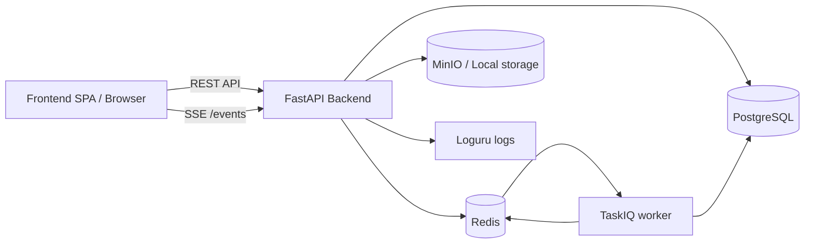
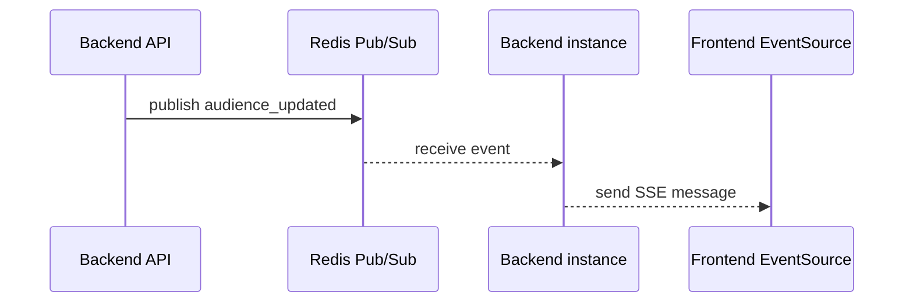

<div align="center">

# BGITU Hardware Management

### Веб-приложение для учета оборудования в корпусах, на этажах и в аудиториях БГИТУ

<p>
  
  
  
  
  
  
  
  
</p>

<p>
  <b>Учет оборудования · аудит действий · файлы · аналитика · SSE realtime · уведомления</b>
</p>

</div>

---

## Содержание

- [О проекте](#о-проекте)
- [Возможности](#возможности)
- [Технологический стек](#технологический-стек)
- [Архитектура](#архитектура)
- [Структура проекта](#структура-проекта)
- [Требования](#требования)
- [Быстрый старт локально](#быстрый-старт-локально)
- [Запуск через Docker Compose](#запуск-через-docker-compose)
- [Конфигурация](#конфигурация)
- [Хранение файлов](#хранение-файлов)
- [SSE и realtime](#sse-и-realtime)
- [API](#api)
- [Seed-данные](#seed-данные)
- [Проверки качества](#проверки-качества)
- [Roadmap](#roadmap)

---

## О проекте

**BGITU Hardware Management** — веб-приложение для централизованного учета компьютерного оборудования, размещенного в учебных корпусах и аудиториях.

Система помогает хранить сведения об аудиториях, оборудовании, файлах, пользователях и действиях в одном месте.
Backend предоставляет REST API для frontend-приложения, поддерживает аутентификацию, аудит, аналитику, фоновые задачи, хранение файлов и realtime-обновления через SSE.
Frontend на Vue 3 включает схемы этажей, сетки оборудования, аналитику, администрирование и светлую/темную темы.

Проект ориентирован на практическую эксплуатацию в образовательной организации: преподаватель или администратор может быстро открыть аудиторию, увидеть оборудование, изменить его состояние и зафиксировать событие в системе.

---

## Возможности

### Учет оборудования

- учет корпусов и аудиторий;
- учет оборудования с координатами на сетке аудитории;
- хранение инвентарных и серийных номеров;
- хранение характеристик оборудования;
- загрузка файлов и аватаров;
- получение аналитики по оборудованию.

### Пользователи и доступ

- аутентификация через access token и refresh token;
- пользователи, роли и создание учётных записей администратором;
- хранение refresh-сессий;
- фоновая очистка устаревших сессий;
- разграничение доступа к защищенным endpoint-ам.

### Аудит и realtime

- журнал действий пользователей;
- фиксация значимых операций;
- SSE-обновления данных аудитории без перезагрузки страницы;
- realtime-уведомления frontend-клиентов;
- Redis-backed Pub/Sub для доставки realtime-событий между backend-инстансами.

### Интеграции и инфраструктура

- MinIO для объектного хранения файлов;
- TaskIQ для асинхронных фоновых задач.

---

## Технологический стек


| Область         | Технологии                                   |
| --------------- | -------------------------------------------- |
| Backend         | Python 3.14, FastAPI, Pydantic               |
| Frontend        | Vue 3, Pinia, Vue Router, Vite               |
| Database        | PostgreSQL, SQLAlchemy 2.x, asyncpg, Alembic |
| Cache / Broker  | Redis                                        |
| Background jobs | TaskIQ, Redis Streams, TaskIQ Scheduler      |
| File storage    | Local storage, MinIO                         |
| Realtime        | SSE, Redis Pub/Sub                           |
| Logging         | Loguru                                       |
| Tooling         | uv, Docker, Docker Compose                   |


---

## Архитектура


```mermaid
flowchart LR
    Client[Frontend SPA / Browser] -->|REST API| API[FastAPI Backend]
    Client -->|SSE /events| API

    API --> DB[(PostgreSQL)]
    API --> Redis[(Redis)]
    API --> Storage[(MinIO / Local storage)]
    API --> Logs[Loguru logs]

    Redis --> TaskIQ[TaskIQ worker]
    TaskIQ --> DB
    TaskIQ --> Redis
```


Основной поток работы:

1. frontend отправляет запрос к backend API;
2. backend проверяет пользователя и права доступа;
3. сервисный слой выполняет бизнес-логику;
4. данные сохраняются в PostgreSQL;
5. при необходимости создается audit log;
6. realtime-событие публикуется через Redis Pub/Sub;
7. подключенные клиенты получают обновление через SSE.

---

## Структура проекта

```text
.
├── api/              # HTTP endpoints
├── core/             # конфигурация, безопасность, ошибки и логирование
├── db/               # engine, sessions, database setup
├── modules/          # модули приложения: use cases, ports и события
├── models/           # общий реестр моделей модулей
├── services/         # общие инфраструктурные адаптеры
├── dependencies/     # composition root для FastAPI
├── management/       # bootstrap и CLI управления пользователями
├── tasks/            # Асинхронные задачи TaskIQ
├── utils/            # вспомогательные функции
├── websocket/        # realtime-логика и Redis-backed SSE
├── alembic/          # миграции базы данных
├── frontend/         # Vue-приложение и Nginx
├── tests/            # тесты поведения, архитектуры и интеграций
├── .github/          # CI и обновления зависимостей
├── static/           # загруженные файлы и аватары
└── logs/             # лог-файлы приложения
```

---

## Требования

Для локального запуска понадобятся:

- Python 3.14 для текущего окружения, Docker и CI; минимальная версия в `pyproject.toml` — 3.13
- Node.js 22.12+ для сборки frontend
- PostgreSQL 17+ или совместимая версия
- Redis 7+
- MinIO, если используется объектное хранилище
- `uv`
- Docker и Docker Compose для контейнерного запуска

---

## Быстрый старт локально

### 1. Подготовить переменные окружения

```powershell
Copy-Item .env.example .env
```

Проверьте минимально необходимые группы переменных:

```text
BGITU__DB__*
BGITU__JWT__ACCESS_SECRET_KEY
BGITU__TASKIQ__BROKER_URL
BGITU__TASKIQ__RESULT_BACKEND
BGITU__STORAGE__*
BGITU__WEBSOCKET__*
BGITU__BOOTSTRAP__SUPERUSER_EMAIL
BGITU__BOOTSTRAP__SUPERUSER_PASSWORD
```

### 2. Поднять инфраструктуру

```powershell
docker compose up -d db redis minio
```

После запуска будут доступны:


| Сервис        | Адрес                   |
| ------------- | ----------------------- |
| PostgreSQL    | `localhost:5433`        |
| Redis         | `localhost:6379`        |
| MinIO API     | `http://localhost:9005` |
| MinIO Console | `http://localhost:9006` |


### 3. Установить зависимости

```powershell
uv sync --locked --dev
```

### 4. Применить миграции

```powershell
uv run alembic upgrade head
```

### 5. Инициализировать базу

```powershell
uv run python -m management.bootstrap
```

Для пустой базы перед первым запуском задайте
`BGITU__BOOTSTRAP__SUPERUSER_EMAIL` и
`BGITU__BOOTSTRAP__SUPERUSER_PASSWORD`. После успешного создания SU обе
переменные можно удалить: повторный bootstrap не меняет существующего
пользователя и его пароль.

### 6. Запустить backend

```powershell
uv run uvicorn main:app --reload
```

Приложение будет доступно по адресу:

```text
http://127.0.0.1:8000
```

OpenAPI-документация:

```text
http://127.0.0.1:8000/docs
http://127.0.0.1:8000/redoc
```

### 7. Запустить TaskIQ

Worker:

```powershell
uv run taskiq worker taskiq_app:broker tasks.sessions --workers 1 --max-async-tasks 1 --ack-type when_saved
```

Планировщик (один экземпляр):

```powershell
uv run taskiq scheduler taskiq_app:scheduler tasks.sessions --skip-first-run
```

---

## Запуск через Docker Compose

Полный стек поднимается одной командой:

```powershell
docker compose up -d --build
```

Одноразовый контейнер `app_init` применяет миграции и выполняет bootstrap.
Backend и TaskIQ запускаются только после его успешного завершения.

Для Docker Compose используется обычный `.env`. В репозитории есть пример:

```text
.env.example
```

Создайте локальный файл окружения:

```powershell
Copy-Item .env.example .env
```

Локальные секреты и переопределения храните в `.env`. Этот файл игнорируется git.

---

## Конфигурация

Настройки читаются из переменных окружения с префиксом `BGITU__`.


| Группа                | Назначение                                   |
| --------------------- | -------------------------------------------- |
| `BGITU__DB__*`        | подключение к PostgreSQL                     |
| `BGITU__JWT__*`       | access token и время жизни токенов           |
| `BGITU__TASKIQ__*`    | Redis Streams, хранилище результатов и их TTL |
| `BGITU__STORAGE__*`   | backend хранения файлов: `local` или `minio` |
| `BGITU__WEBSOCKET__*` | realtime и Redis для SSE                     |
| `BGITU__BOOTSTRAP__*` | начальные корпуса и первый суперпользователь |
| `BGITU__CORS_ORIGINS` | список разрешенных origin для frontend       |
| `BGITU__FRONTEND_URL` | URL frontend для проверки Origin запросов    |


Для PostgreSQL в Docker также нужны:

```text
POSTGRES_USER
POSTGRES_PASSWORD
POSTGRES_DB
```

Пример `BGITU__CORS_ORIGINS`:

```env
BGITU__CORS_ORIGINS=["http://localhost:5173","http://127.0.0.1:5173"]
```

---

## Хранение файлов

Файлы оборудования и аватары отдаются через backend API, а не напрямую из bucket.
Так сохраняется проверка прав на endpoint-ах.

```text
/api/v1/hardware/files/{file_id}
/api/v1/hardware/stream/{file_id}
/api/v1/users/me/photo
```

В Docker Compose используется MinIO.

При замене аватара и удалении вложения старый объект удаляется только после
подтвержденного commit БД. Новые загрузки очищаются при rollback до начала
COMMIT, включая ошибки аудита, flush и отмену запроса после загрузки. Ошибка
или отмена во время COMMIT может означать потерю ответа уже выполненной
транзакции: в этом случае сохраняются и старые, и новые файлы, а неопределенный
исход записывается в журнал. Перед удалением лишних файлов проверьте ссылки
на них в БД. Это компенсация, а не общая транзакция PostgreSQL и MinIO:
аварийное завершение процесса или недоступность хранилища тоже могут оставить
лишний объект; ошибки очистки записываются в журнал.

Доступ с хоста:


| Компонент     | Адрес                   |
| ------------- | ----------------------- |
| MinIO API     | `http://localhost:9005` |
| MinIO Console | `http://localhost:9006` |


Основные переменные:

```env
BGITU__STORAGE__BACKEND=minio
BGITU__STORAGE__ENDPOINT=localhost:9005
BGITU__STORAGE__ACCESS_KEY=replace-with-minio-access-key
BGITU__STORAGE__SECRET_KEY=replace-with-minio-secret-key
BGITU__STORAGE__BUCKET=bgitu-files
BGITU__STORAGE__SECURE=false
```

---

## SSE и realtime

SSE endpoint:

```text
/events
```

Подключение к конкретной аудитории:

```text
/events?audience_id=123
```

Подключение ко всем аудиториям:

```text
/events
```

`audience_id` — это `id` аудитории в базе, а не номер кабинета.

Пример подключения с frontend:

```ts
const events = new EventSource(
  `http://localhost:8000/events?audience_id=${audienceId}`
);
```

Payload события:

```json
{
  "audience_updated": 123
}
```

### Как работает доставка событий


```mermaid
sequenceDiagram
    participant API as Backend API
    participant Redis as Redis Pub/Sub
    participant Instance as Backend instance
    participant Client as Frontend EventSource

    API->>Redis: publish audience_updated
    Redis-->>Instance: receive event
    Instance-->>Client: send SSE message
```


Если `BGITU__WEBSOCKET__ENABLED=0`, то:

- `/events` не принимает подключения;
- realtime-события из HTTP endpoint-ов не публикуются;
- Redis-клиенты для SSE не создаются.

## API

Основная документация API доступна через Swagger UI:

```text
http://127.0.0.1:8000/docs
```

Основные группы endpoint-ов:

```text
/api/v1/auth
/api/v1/users
/api/v1/offices
/api/v1/audiences
/api/v1/hardware
/api/v1/analytics/hardware
/api/v1/notifications
```

---

## Сессии в браузере

Для автоматического обновления сессии между вкладками frontend использует Web Locks:
в production требуется HTTPS (локально подходит `localhost`). Без поддержки Web Locks
автоматический refresh отключён, ручной вход остаётся доступен.

## Seed-данные

Команда:

```powershell
uv run python -m management.bootstrap
```

Идемпотентно добавляет:

- корпус с `id=1`;
- корпус с `id=2`;
- первого суперпользователя, только если в базе ещё нет SU.

Bootstrap не перезаписывает пароль существующего пользователя и не повышает
обычного пользователя до SU. Параллельные запуски bootstrap выполняются
последовательно под блокировкой PostgreSQL. При ошибке изменения данных
откатываются целиком; sequence корпусов может сохранить пропуски ID.
После добавления корпусов sequence синхронизируется с их ID.

Если SU уже существует, credentials из `.env`
игнорируются. Для ручного создания дополнительного администратора или SU
используйте CLI:

```powershell
uv run python -m management.users create-su --email admin@example.ru
uv run python -m management.users create-admin --email manager@example.ru
```

---

## Проверки качества

Из корня проекта:

```powershell
uv sync --locked --dev
uv run --no-sync ruff check .
uv run --no-sync pytest -q
docker compose config --quiet
```

В каталоге `frontend`:

```powershell
npm ci
npm test
npm run build
```

GitHub Actions выполняет эти проверки для pull request и изменений ветки
`prod`. В CI дополнительно запускаются отдельные PostgreSQL 17 и Redis 7:
проверяются вся цепочка миграций, сохранение существующих записей и доставка
задач TaskIQ. CI не разворачивает приложение и не использует данные сервера.

Локальные интеграционные проверки включаются через `TEST_POSTGRES_URL`
(`postgresql+asyncpg://...`) и `TEST_TASKIQ_REDIS_URL` (`redis://...`). Используйте
отдельные тестовые экземпляры. PostgreSQL-тесты создают и удаляют только
уникальную схему `test_bgitu_*`, а Redis-тесты работают с уникальными ключами.
Без этих переменных интеграционные проверки пропускаются.

---

## Roadmap

- [x] CRUD по корпусам
- [x] CRUD по аудиториям
- [x] CRUD по оборудованию
- [x] Координаты оборудования на сетке аудитории
- [x] Access token и refresh token
- [x] Роли пользователей
- [x] Создание пользователей администратором
- [x] Загрузка файлов
- [x] Аудит действий
- [x] Аналитика по оборудованию
- [x] SSE realtime-обновления
- [x] Асинхронные задачи TaskIQ
- [x] MinIO-хранилище
- [x] Frontend realtime-уведомления
- [ ] Расширенная аналитика неисправностей
- [ ] История обслуживания оборудования
- [ ] Заявки на ремонт
- [ ] Экспорт отчетов

---

## Автор

**Мишин А.М.**

ФГБОУ ВО «Брянский государственный инженерно-технологический университет»
Кафедра «Информационные технологии»

---


**BGITU Hardware Management**
Учебный проект для автоматизации учета компьютерного оборудования университета.
